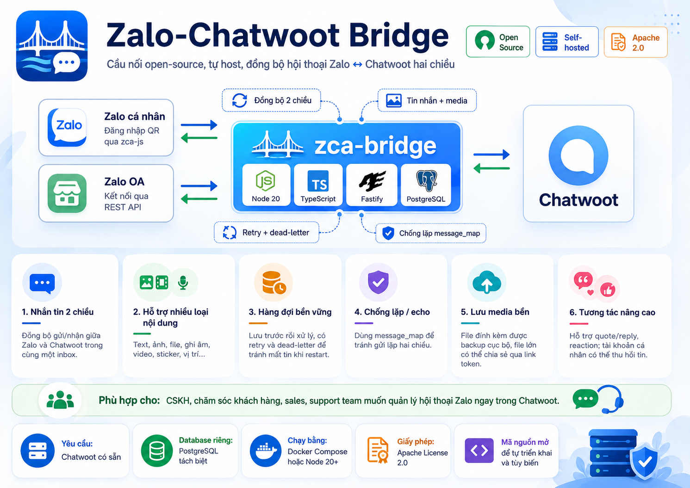

🇬🇧 English: [README.en.md](README.en.md)

# Zalo-Chatwoot Bridge



[](https://github.com/diendh/zca-bridge/actions/workflows/ci.yml)
[](LICENSE)

Cầu nối sidecar tự host, giúp đồng bộ hội thoại [Zalo](https://zalo.me) hai chiều với
[Chatwoot](https://www.chatwoot.com). Dự án này cho phép hiển thị và xử lý tin nhắn Zalo như một
inbox trong Chatwoot — có thể nhận và gửi tin nhắn từ cùng một giao diện.

Dự án hỗ trợ hai hướng tích hợp:

* **Zalo Official Account (OA)**: sử dụng API chính thức của Zalo.
* **Tài khoản Zalo cá nhân**: sử dụng [`zca-js`](https://github.com/RFS-ADRENO/zca-js), đăng nhập bằng QR. Đây là thư viện không chính thức và có rủi ro riêng.

Tên package/kỹ thuật: `zca-bridge`.

Node 24 · TypeScript (ESM) · Fastify · PostgreSQL.

> Đây là dự án độc lập, không thuộc sở hữu, không được tài trợ và không được xác nhận chính thức bởi Zalo, VNG, Chatwoot hoặc nhóm phát triển `zca-js`.

## Tại sao quan trọng

Đội ngũ chăm sóc khách hàng ở Việt Nam gắn liền với Zalo, nhưng Zalo không có tích hợp Chatwoot gốc,
nên nhân viên phải dùng app Zalo tách rời khỏi helpdesk của họ. Cầu nối này đưa Zalo vào Chatwoot như
một inbox bình thường, tự host nên dữ liệu hội thoại nằm trên hạ tầng do bạn kiểm soát.

## Tình huống sử dụng

- Đội hỗ trợ của SMB và agency muốn gom các kênh về Chatwoot.
- Đội đã dùng Chatwoot, muốn thêm Zalo mà không qua dịch vụ SaaS trung gian.
- Doanh nghiệp dùng Zalo OA, muốn cộng tác giữa nhân viên, ghi chú và lịch sử trong Chatwoot.
- Tự host để đáp ứng data residency và quyền riêng tư.

## ⚠️ Cảnh báo rủi ro

Kênh **tài khoản Zalo cá nhân** hoạt động thông qua [`zca-js`](https://github.com/RFS-ADRENO/zca-js),
một thư viện không chính thức. Việc sử dụng API không chính thức có thể khiến tài khoản Zalo bị hạn chế,
khóa hoặc cấm vĩnh viễn.

Hãy cân nhắc kỹ trước khi sử dụng. Nên dùng tài khoản phụ hoặc tài khoản thử nghiệm, không nên dùng
tài khoản quan trọng, tài khoản kinh doanh chính hoặc tài khoản có dữ liệu nhạy cảm.

Dự án này không đảm bảo an toàn tài khoản và không chịu trách nhiệm cho bất kỳ sự cố nào phát sinh
khi sử dụng kênh tài khoản cá nhân.

> Using unofficial APIs may get your account restricted, locked, or permanently banned. Use it at your own risk.

Riêng kênh **Zalo Official Account (OA)** sử dụng API chính thức của Zalo nên không thuộc nhóm rủi ro
từ `zca-js`. Xem [SECURITY.vi.md](SECURITY.vi.md).

## Tính năng

* Nhắn tin hai chiều Zalo ↔ Chatwoot.
* Hỗ trợ text, ảnh, file, ghi âm, video, sticker, vị trí…
* Hàng đợi bền: lưu trước rồi mới xử lý, có retry và dead-letter.
* Chống lặp/echo hai chiều bằng `message_map`.
* Lưu trữ media bền: mọi file đính kèm được backup cục bộ; file lớn có thể phục vụ qua link có token.
* Hỗ trợ trả lời trích dẫn, reaction và thu hồi tin nhắn cho tài khoản cá nhân.
* OA hỗ trợ trả lời trích dẫn dạng text.

## Kiến trúc

Cầu nối luân chuyển tin nhắn theo hai luồng bền, cả hai đều dựa trên hàng đợi job trong PostgreSQL.

- **Inbound:** sự kiện Zalo cá nhân (qua adapter `zca-js`) và webhook OA → phân loại (classify) →
  hàng đợi job bền (PostgreSQL) → worker → Chatwoot Application/Platform API.
- **Outbound:** webhook Chatwoot → hàng đợi → worker → Zalo (personal sender / OA sender).
- `message_map` chống lặp echo giữa hai hệ thống; media được archive cục bộ và phục vụ qua link có
  token khi cần.

### Module map

- `src/zalo` — personal adapter, classify, session, QR login.
- `src/zalo-oa` — OA OAuth, webhook, sender, backfill.
- `src/chatwoot` — client, webhook server.
- `src/worker` + `src/store` — durable queue, repos, migrations.
- `src/handlers` — inbound/outbound orchestration.
- `src/admin` — admin API + dashboard.
- `src/media` — archive + tokenized serving.

## Tài liệu

Hướng dẫn đầy đủ nằm trong [wiki của dự án](https://github.com/diendh/zca-bridge/wiki) (English +
Tiếng Việt):

- [Cài đặt](https://github.com/diendh/zca-bridge/wiki/Installation-vi)
- [Cấu hình](https://github.com/diendh/zca-bridge/wiki/Configuration-vi) — bảng tham chiếu env đầy đủ
- [Kiến trúc](https://github.com/diendh/zca-bridge/wiki/Architecture-vi)
- [Thiết lập Chatwoot](https://github.com/diendh/zca-bridge/wiki/Chatwoot-Setup-vi)
- [Tài khoản Zalo cá nhân](https://github.com/diendh/zca-bridge/wiki/Zalo-Personal-Account-vi) · [Thiết lập Zalo OA](https://github.com/diendh/zca-bridge/wiki/Zalo-OA-Setup-vi)
- [Xử lý sự cố](https://github.com/diendh/zca-bridge/wiki/Troubleshooting-vi)

## Yêu cầu

* Bạn cần tự chuẩn bị một hệ thống Chatwoot đang hoạt động.
* Dự án này **không kèm theo và không phân phối Chatwoot**.
* Cần một PostgreSQL riêng cho bridge, tách khỏi database của Chatwoot.
* Bridge tự chạy migration khi khởi động.
* Node 24+ hoặc Docker.

## Cấu hình

Copy `.env.example` thành `.env` rồi điền giá trị cần thiết. Mỗi biến đều có chú thích trong
`.env.example`.

Tối thiểu cần cấu hình:

* `DATABASE_URL`
* `CHATWOOT_BASE_URL`
* `CREDENTIALS_KEY`
* `PUBLIC_BASE_URL`

Ví dụ:

```bash
cp .env.example .env
```

Sau đó sửa file `.env` theo môi trường của bạn.

## Chạy

### Image dựng sẵn, không cần build (chỉ một file)

Chạy bridge cùng Postgres của nó thẳng từ image đã publish — không cần tải mã nguồn. Chỉ cần
`docker-compose.full.yml` và một file `.env`:

```bash
cp .env.example .env   # điền CHATWOOT_BASE_URL (Chatwoot của bạn), CREDENTIALS_KEY, PUBLIC_BASE_URL...
docker compose -f docker-compose.full.yml up -d
```

Bridge: `http://localhost:4000`. Tự chuẩn bị Chatwoot (trỏ `CHATWOOT_BASE_URL` tới nó). Image được
pull từ ghcr.io — package phải ở chế độ public, hoặc chạy `docker login ghcr.io` trước.

### Docker Compose — build từ mã nguồn (tự host Chatwoot riêng)

Khuyến nghị dùng Docker Compose:

```bash
cp .env.example .env
docker compose -f docker-compose.example.yml up -d --build
```

File compose mẫu sẽ khởi động bridge và PostgreSQL riêng cho bridge. Biến `CHATWOOT_BASE_URL` cần trỏ
tới Chatwoot có sẵn của bạn.

### Container đơn

```bash
docker run --env-file .env -p 4000:4000 ghcr.io/diendh/zca-bridge:latest
```

Lưu ý: bạn vẫn cần một PostgreSQL và Chatwoot truy cập được.

### Chạy trực tiếp

```bash
npm ci
npm run build
npm start
```

Bridge sẽ tự chạy migration khi khởi động và lắng nghe trên `$PORT`, mặc định là `4000`.

## Kiểm thử

```bash
npx vitest run
```

Một vài test đang bị cách ly vì đã lệch khỏi `src`; xem [ROADMAP.vi.md](ROADMAP.vi.md).

## Lưu ý bảo mật

Thông tin đăng nhập được mã hóa khi lưu (`CREDENTIALS_KEY`, AES-256-GCM). Bảo vệ các endpoint admin và
webhook bằng `ADMIN_TOKEN` / `WEBHOOK_SECRET` / `ZALO_OA_SECRET_KEY`, và dùng một database riêng. Xem
[SECURITY.vi.md](SECURITY.vi.md).

## Lộ trình bảo trì

Xem [ROADMAP.vi.md](ROADMAP.vi.md).

## Cách Codex được sử dụng

Tôi sẽ dùng Codex để bảo trì zca-bridge hiệu quả hơn: review pull request, sinh test, cải thiện chất
lượng code TypeScript, refactor logic đồng bộ Zalo/Chatwoot, kiểm tra độ tin cậy của webhook và hàng
đợi, cải thiện việc triển khai Docker, viết tài liệu, phân loại issue, và review các khu vực nhạy cảm
về bảo mật như token, webhook, upload media, retry, và tích hợp API.

## Ghi chú về bên thứ ba

Dự án này tích hợp hoặc phụ thuộc vào một số sản phẩm/dự án bên thứ ba:

* [Chatwoot](https://www.chatwoot.com)
* [Zalo](https://zalo.me)
* [`zca-js`](https://github.com/RFS-ADRENO/zca-js)

Tất cả tên thương hiệu, logo, nhãn hiệu và tên sản phẩm thuộc về chủ sở hữu tương ứng. Việc nhắc đến
các bên thứ ba trong README chỉ nhằm mục đích mô tả khả năng tích hợp kỹ thuật.

## Giấy phép

Copyright 2026 Tom.

Phát hành theo [Apache License 2.0](LICENSE).

Dự án này chỉ là bridge độc lập. Chatwoot, Zalo và `zca-js` thuộc về chủ sở hữu tương ứng của họ.
